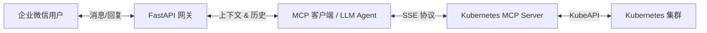

# Chat2K8s

[](https://www.python.org/)
[](https://fastapi.tiangolo.com/)
[](LICENSE)
[](https://modelcontextprotocol.io/)

**Chat2K8s** 是一个连接 **企业微信** 与 **Kubernetes** 的智能运维桥梁，利用 **Model Context Protocol (MCP)** 和 **大语言模型 (LLM)** 实现通过自然语言管理 K8s 集群。

它提供了流畅的 ChatOps 体验，让运维人员和开发者可以直接在企业微信中查询集群状态、查看日志和管理资源，所有操作均由现代 LLM 的推理能力驱动。

---

## 🏗 系统架构

系统由三个核心组件构成：

1.  **FastAPI 网关**：处理微信回调，管理消息队列，维护会话上下文。
2.  **MCP 客户端 (Agent)**：实现 Model Context Protocol 与 MCP Server 通信，利用 LLM (如 GLM-4/5) 决策工具调用。
3.  **Kubernetes MCP Server**：基于 Go 的服务器，通过 Server-Sent Events (SSE) 将 Kubernetes 操作暴露为 MCP 工具。



## ✨ 核心特性

-   **🗣️ 自然语言运维**：使用自然语言与 K8s 交互（例如：“支付服务的 Pod 为什么重启了？”）。
-   **🧠 上下文感知**：支持多轮对话记忆（可配置轮数），支持追问（例如：“查看它的日志”）。
-   **⚡ 异步高效处理**：采用 FastAPI BackgroundTasks 处理耗时的 LLM 推理，绕过微信 5 秒超时限制。
-   **🔌 标准化协议**：基于开放的 Model Context Protocol (MCP) 构建，确保扩展性和兼容性。
-   **🛡️ 企业级安全**：集成企业微信安全机制（签名验证、AES 加解密）。

---

## 🤖 企业微信应用创建指南

要使用本系统，您需要在企业微信后台创建一个应用。以下是详细步骤：

### 1. 创建应用
访问 [企业微信管理后台](https://work.weixin.qq.com/wework_admin/frame#/apps)，点击 **「应用管理」** -> **「创建应用」**。
- 上传应用 Logo，填写应用名称（如 "K8s 助手"），选择可见范围。

### 2. 获取应用凭证 (Secret & AgentId)
创建成功后，在应用详情页可以获取到以下关键信息，请填入 `.env` 文件：
-   **AgentId**: (例如 `1000005`) -> 对应 `.env` 中的 `WECHAT_AGENT_ID`
-   **Secret**: (例如 `y7t0NB**EXAiQBJX8OmFSA`) -> 对应 `.env` 中的 `WECHAT_CORP_SECRET`

### 3. 配置 API 接收消息
在应用详情页，找到 **「接收消息」** -> **「设置 API 接收」**：
-   **URL**: 填入您的服务器公网地址（需包含完整路由路径）。
    -   示例：`http://hachimi.net:6789/api/wechat/callback`
    -   *注意：如果使用 `make run` 默认端口 8000，请确保防火墙放行或使用反向代理。*
-   **Token**: 随机获取或自定义 (例如 `raMPv**aP9OAQ7`) -> 对应 `.env` 中的 `WECHAT_TOKEN`
-   **EncodingAESKey**: 随机获取 (例如 `v1o**AOkysL7QniMHkR3`) -> 对应 `.env` 中的 `WECHAT_ENCODING_AES_KEY`

### 4. 获取企业 ID (CorpID)
进入 **「我的企业」** -> **「企业信息」** 页面底部：
-   **企业 ID**: (例如 `wwe**5ebd5`) -> 对应 `.env` 中的 `WECHAT_CORP_ID`

---

## 🚀 快速开始

### 前置要求

-   **操作系统**: Linux / macOS
-   **Python**: 3.10+
-   **Go**: 1.21+ (用于编译 MCP Server)
-   **包管理器**: [uv](https://github.com/astral-sh/uv) (推荐)
-   **Kubernetes**: 有效的 `kubeconfig` 文件

### 安装步骤

1.  **克隆仓库**
    ```bash
    git clone https://github.com/your-org/chat2k8s.git
    cd chat2k8s
    ```

2.  **初始化项目**
    使用 `Makefile` 自动安装依赖并编译 Go 服务：
    ```bash
    make init
    ```

### 配置文件

1.  **复制配置模版**
    ```bash
    cp .env.example .env
    ```

2.  **编辑 `.env`**
    根据[上方指南](#-企业微信应用创建指南)填入凭证：

    ```ini
    # --- 微信配置 ---
    WECHAT_CORP_ID=wwe**5ebd5            # 企业 ID
    WECHAT_CORP_SECRET=y7t0NB...         # 应用 Secret
    WECHAT_AGENT_ID=1000005              # 应用 AgentId
    WECHAT_TOKEN=raMPv...                # API Token
    WECHAT_ENCODING_AES_KEY=v1o...       # EncodingAESKey

    # --- LLM 配置 ---
    OPENAI_API_KEY=sk-proj-...           # LLM API Key
    OPENAI_BASE_URL=https://...          # 模型服务地址
    OPENAI_MODEL=zai-org/glm-5           # 模型名称
    
    # --- 系统配置 ---
    MCP_SERVER_URL=http://localhost:5678/sse
    MAX_HISTORY_ROUNDS=10                # 上下文记忆轮数
    ```

3.  **导入 K8s 配置**
    将您的 `config` 文件放入 `kubeConfig/` 目录：
    ```bash
    mkdir -p kubeConfig
    cp ~/.kube/config kubeConfig/config.yaml
    ```

---

## 🖥️ 使用指南

### 服务管理

本项目使用 `Makefile` 进行快捷管理：

| 命令 | 说明 |
| :--- | :--- |
| `make start` | 后台启动 Kubernetes MCP Server (SSE 模式) |
| `make run` | 启动 Python FastAPI 主程序 |
| `make status` | 检查 MCP Server 运行状态和 PID |
| `make stop` | 停止 MCP Server |
| `make clean` | 清理构建产物和日志 |

### 启动流程

1.  **启动后端 (MCP Server)**
    ```bash
    make start
    ```
    *终端将显示 PID 和日志路径。*

2.  **启动网关**
    ```bash
    make run
    ```
    *FastAPI 服务默认监听 8000 端口。*

3.  **验证连接**
    在企业微信应用中发送 "查看所有 namespace"，如果配置正确，您将收到 AI 的回复。

4. **最终效果**
    
---

## 📂 项目结构

```text
chat2k8s/
├── app/
│   ├── api/                # API 路由 (微信回调)
│   │   └── wechat.py       # 微信消息处理逻辑
│   ├── core/               # 核心配置
│   │   └── config.py       # Pydantic 配置类
│   └── mcp/                # MCP 客户端
│       └── client.py       # Agent 逻辑与工具调用
├── dist/                   # 编译产物 (二进制文件, PID, 日志)
├── kubeConfig/             # K8s 集群配置文件
├── kubernetes-mcp-server/  # 子模块: MCP Server (Go)
├── main.py                 # 程序入口
├── Makefile                # 自动化脚本
└── pyproject.toml          # Python 依赖配置 (uv)
```

## 🛠 常见问题 (Troubleshooting)

-   **编译失败**: 请确保 `go` 已安装并在 PATH 中。`make init` 需要 Go 环境来编译 MCP Server。
-   **微信超时**: 微信要求 5 秒内响应。如果遇到超时，请检查 `wechat.py` 中的 `BackgroundTasks` 是否正常工作。
-   **MCP 连接拒绝**: 检查 `dist/mcp.log` 日志，确认 MCP Server 是否启动成功（常见原因是 kubeconfig 路径错误）。

## 📄 License

This project is licensed under the MIT License. See the [LICENSE](LICENSE) file for details.
