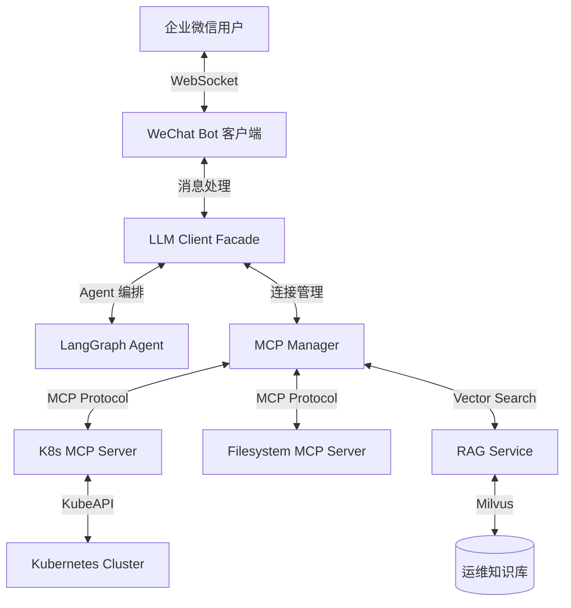

# Chat2K8s 🚀

[](https://www.python.org/)
[](https://modelcontextprotocol.io/)
[](https://kubernetes.io/)

**Chat2K8s** 是一个进化的智能运维助手，通过 **Model Context Protocol (MCP)** 将 **企业微信** 与 **Kubernetes** 集群深度集成。它允许运维人员通过自然语言进行集群查询、故障诊断和资源管理，并集成了 **RAG (检索增强生成)** 技术以提供精准的运维知识支持。

---

## ✨ 核心进化特性

- **🗣️ 自然语言交互**：直接在企业微信中通过对话管理 K8s 资源。
- **🔌 MCP 深度集成**：采用 Model Context Protocol，支持动态工具发现与调用，原生支持 K8s 资源操作与文件系统访问。
- **📚 RAG 知识增强**：集成 Milvus 向量数据库与 Rerank 模型，支持基于本地运维文档的精准问答（可通过 `.env` 开启）。
- **🌊 极致流式体验**：
  - **实时状态反馈**：从“正在思考”到“正在调用工具(参数)...”的丝滑切换。
  - **过程透明化**：多行状态累加显示，完整展示 AI 的思考与工具执行轨迹。
  - **内容纯净**：最终回答自动替换中间状态，保持对话框整洁。
- **🛠️ 强力 Agent 架构**：基于 LangGraph 构建，具备多轮对话记忆与复杂的工具编排能力。

---

## 🏗 系统架构



---

## 🚀 快速开始

### 前置要求
- **Python**: 3.12+
- **Docker**: 用于运行 MCP Server 容器
- **Kubernetes**: 有效的 `kubeconfig` 文件
- **企业微信**: 已配置的机器人凭证（ID & Secret）

### 安装与运行

1. **安装依赖** (推荐使用 [uv](https://github.com/astral-sh/uv))
   ```bash
   uv sync
   ```

2. **配置环境变量**
   ```bash
   cp .env.example .env
   # 编辑 .env 填入 WECHAT, OPENAI 及 RAG 相关配置
   ```

3. **启动服务**
   ```bash
   uv run main.py
   ```

---

## ⚙️ 配置说明 (.env)

项目采用高度模块化的配置，特别是 RAG 相关参数已统一前缀：

| 配置项 | 说明 |
| :--- | :--- |
| `WECHAT_BOT_ID` | 企业微信机器人 ID |
| `WECHAT_BOT_SECRET` | 企业微信机器人 Secret |
| `OPENAI_MODEL` | 使用的主模型（如 `zai-org/glm-5`） |
| `RAG_ENABLED` | 是否开启 RAG 增强 (True/False) |
| `RAG_EMBEDDING_MODEL` | 向量嵌入模型 |
| `RAG_MILVUS_HOST` | Milvus 数据库地址 |
| `RAG_RERANK_MODEL` | 重排序模型 |
| `MCP_K8S_COMMAND` | K8s MCP Server 启动命令 |
| `MCP_FS_COMMAND` | Filesystem MCP Server 启动命令 |

---

## 📂 项目结构

```text
chat2k8s/
├── app/
│   ├── core/
│   │   └── config.py           # 全局配置管理 (Pydantic)
│   ├── llm/
│   │   ├── agent.py            # LangGraph Agent 逻辑与状态管理
│   │   ├── client.py           # 统一入口 (Facade)，协调 Agent 与 MCP
│   │   ├── mcp_core.py         # MCP 连接管理与工具调用核心
│   │   ├── rag.py              # RAG 检索与重排序服务
│   │   └── utils.py            # 工具函数 (Token 计数等)
│   ├── wechat/
│   │   ├── bot.py              # WeChatBot 类，WebSocket 长连接管理
│   │   ├── crypto.py           # 企业微信加解密工具
│   │   └── handlers.py         # 消息解析与分发 (文本/图片/文件)
│   └── utils/
├── main.py                     # 程序入口，生命周期管理
├── pyproject.toml              # 项目依赖配置
└── README.md                   # 项目文档
```

---

## 🛠 运维指令示例

- “查看集群1中所有 namespace”
- “帮我看看 default 命名空间下有哪些 Pod 在报错？”
- “查看 pod [name] 的最后 50 行日志”
- “根据运维手册，如何处理 ImagePullBackOff 错误？” (需开启 RAG)
- “/clear” - 清理当前对话上下文

---

## 📄 License

MIT License.
